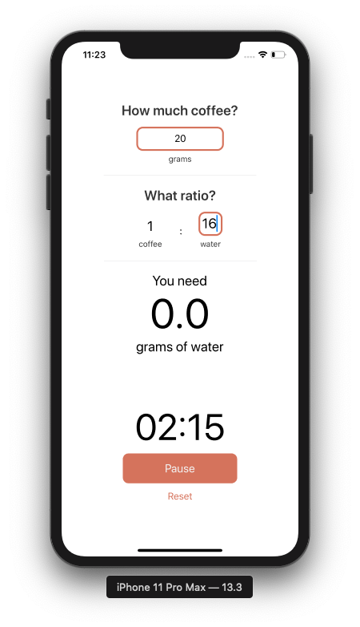

# Ratios

This is an open source app made to help home brewers brew their coffee by calculating the grams of water needed,
and run a timer all in the same screen. 

This is perfect for:
- Chemex
- French Press
- V60
- Drip Pot
- other slow bar methods 

